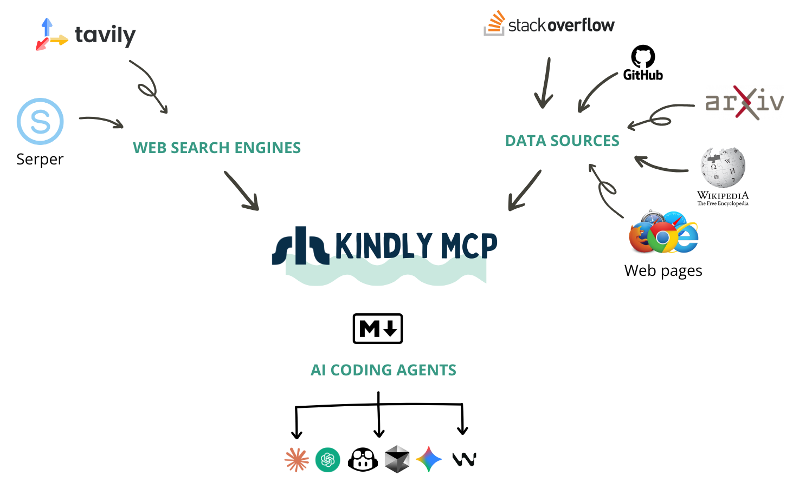

# Kindly Web Search MCP Server

**Web search + robust content retrieval for AI coding tools.**



## Why do we need another web search MCP server?

Picture this: You're debugging a cryptic error in Google Cloud Batch with GPU instances. Your AI coding assistant searches the web and finds the *perfect* StackOverflow thread. Great, right? Not quite. Here's what most web search MCP servers give your AI:

```json
{
  "title": "GCP Cloud Batch fails with the GPU instance template",
  "url": "https://stackoverflow.com/questions/76546453/...",
  "snippet": "I am trying to run a GCP Cloud Batch job with K80 GPU. The job runs for ~30 min. and then fails..."
}
```

The question is there, but **where are the answers?** Where are the solutions that other developers tried? The workarounds? The "this worked for me" comments?

They're not there. Your AI now has to make a second call to scrape the page. Sometimes it does, sometimes it doesn't. And even when it does, most scrapers return either incomplete content or the entire webpage with navigation panels, ads, and other noise that wastes tokens and confuses the AI.

### The Real Problem

At [Shelpuk AI Technology Consulting](https://shelpuk.com), we build custom AI products under a fixed-price model. Development efficiency isn't just nice to have - it's the foundation of our business. We've been using AI coding assistants since 2023 (GitHub Copilot, Cursor, Windsurf, Claude Code, Codex), and we noticed something frustrating:

**When we developers face a complex bug, we don't just want to find a URL - we want to find the conversation.** We want to see what others tried, what worked, what didn't, and why. We want the GitHub Issue with all the comments. We want the StackOverflow thread with upvoted answers and follow-up discussions. We want the arXiv paper content, not just its abstract.

Existing web search MCP servers are basically wrappers around search APIs. They're great at *finding* content, but terrible at *delivering* it in a way that's useful for AI coding assistants.

### What Kindly Does Differently

We built Kindly Web Search because we needed our AI assistants to work the way *we* work. When searching for solutions, Kindly:

✅ **Integrates directly with APIs** for StackExchange, GitHub Issues, arXiv, and Wikipedia - presenting content in LLM-optimized formats with proper structure

✅ **Returns the full conversation** in a single call: questions, answers, comments, reactions, and metadata

✅ **Parses any webpage in real-time** using a headless browser for cutting-edge issues that were literally posted yesterday

✅ **Passes all useful content to the LLM immediately** - no need for a second scraping call

✅ **Supports multiple search providers** (Serper and Tavily) with intelligent fallback

Now, when Claude Code or Codex searches for that GPU batch error, it gets the question *and* the answers. The code snippets. The "this fixed it for me" comments. Everything it needs to help you solve the problem - **in one call**.

## One MCP Server to Rule Them All

Kindly eliminates the need for:

✅ Generic web search MCP servers

✅ StackOverflow MCP servers

✅ Web scraping MCP servers (Playwright, Puppeteer, etc.)

It also significantly reduces reliance on GitHub MCP servers by providing structured Issue content through intelligent extraction.

Kindly has been our daily companion in production work for months, saving us countless hours and improving the effectiveness of our AI coding assistants. We're excited to share it with the community!

**Tools**
- `web_search(query, num_results=3)` → top results with `title`, `link`, `snippet`, and `page_content` (Markdown, best-effort).
- `get_content(url)` → `page_content` (Markdown, best-effort).

Search uses **Serper** (primary, if configured) or **Tavily**, and page extraction uses a local Chromium-based browser via `nodriver`.

## Requirements
- A search API key: `SERPER_API_KEY` **or** `TAVILY_API_KEY`
- A Chromium-based browser installed on the same machine running the MCP client (Chrome/Chromium/Edge/Brave)
- Highly recommended: `GITHUB_TOKEN` (renders GitHub Issues in a much more LLM-friendly format: question + answers/comments + reactions/metadata; fewer rate limits)

`GITHUB_TOKEN` can be read-only and limited to public repositories to avoid security/privacy concerns.

## Quickstart

### 1) Install `uvx`
macOS / Linux:
```bash
curl -LsSf https://astral.sh/uv/install.sh | sh
```

Windows (PowerShell):
```powershell
irm https://astral.sh/uv/install.ps1 | iex
```

Re-open your terminal and verify:
```bash
uvx --version
```

### 2) Install a Chromium-based browser (required for `page_content`)
You need **Chrome / Chromium / Edge / Brave** installed on the same machine running your MCP client.

macOS:
- Install Chrome, or:
```bash
brew install --cask chromium
```

Windows:
- Install Chrome or Edge.
- If browser auto-detection fails later, you’ll need the path:
```powershell
Get-Command chrome | Select-Object -ExpandProperty Source
# Common path:
# C:\Program Files\Google\Chrome\Application\chrome.exe
# If `Get-Command chrome` fails, try one of these:
# C:\Program Files (x86)\Google\Chrome\Application\chrome.exe
# C:\Program Files\Microsoft\Edge\Application\msedge.exe
```

Linux (Ubuntu/Debian):
```bash
sudo apt-get update
sudo apt-get install -y chromium
which chromium
```
Other Linux distros: install `chromium` (or `chromium-browser`) via your package manager.

### 3) Set your search API key (required)
Set **one** of these:

macOS / Linux:
```bash
export SERPER_API_KEY="..."
# or:
export TAVILY_API_KEY="..."
```

Windows (PowerShell):
```powershell
$env:SERPER_API_KEY="..."
# or:
$env:TAVILY_API_KEY="..."
```

Optional (recommended for better GitHub Issue / PR extraction):
```bash
export GITHUB_TOKEN="..."
```
For public repos, a read-only token is enough (classic tokens often use `public_repo`; fine-grained tokens need repo read access).

### 4) Run command used by all MCP clients
```bash
uvx --from git+https://github.com/Shelpuk-AI-Technology-Consulting/kindly-web-search-mcp-server \
  kindly-web-search-mcp-server start-mcp-server
```

Now configure your MCP client to run that command.
Make sure your API keys are set in the same shell/OS environment that launches the MCP client (unless you paste them directly into the client config).

## Client setup

### Codex
Set either `SERPER_API_KEY` or `TAVILY_API_KEY` (you can omit the other).

CLI (no file editing) — add a local stdio MCP server:

macOS / Linux (Serper):
```bash
codex mcp add kindly-web-search \
  --env SERPER_API_KEY="$SERPER_API_KEY" \
  --env GITHUB_TOKEN="$GITHUB_TOKEN" \
  --env KINDLY_BROWSER_EXECUTABLE_PATH="$KINDLY_BROWSER_EXECUTABLE_PATH" \
  -- uvx --from git+https://github.com/Shelpuk-AI-Technology-Consulting/kindly-web-search-mcp-server \
  kindly-web-search-mcp-server start-mcp-server
```

macOS / Linux (Tavily):
```bash
codex mcp add kindly-web-search \
  --env TAVILY_API_KEY="$TAVILY_API_KEY" \
  --env GITHUB_TOKEN="$GITHUB_TOKEN" \
  --env KINDLY_BROWSER_EXECUTABLE_PATH="$KINDLY_BROWSER_EXECUTABLE_PATH" \
  -- uvx --from git+https://github.com/Shelpuk-AI-Technology-Consulting/kindly-web-search-mcp-server \
  kindly-web-search-mcp-server start-mcp-server
```

Windows (PowerShell):
```powershell
codex mcp add kindly-web-search `
  --env SERPER_API_KEY="$env:SERPER_API_KEY" `
  --env GITHUB_TOKEN="$env:GITHUB_TOKEN" `
  --env KINDLY_BROWSER_EXECUTABLE_PATH="$env:KINDLY_BROWSER_EXECUTABLE_PATH" `
  -- uvx --from git+https://github.com/Shelpuk-AI-Technology-Consulting/kindly-web-search-mcp-server `
  kindly-web-search-mcp-server start-mcp-server
```

Windows (PowerShell, Tavily):
```powershell
codex mcp add kindly-web-search `
  --env TAVILY_API_KEY="$env:TAVILY_API_KEY" `
  --env GITHUB_TOKEN="$env:GITHUB_TOKEN" `
  --env KINDLY_BROWSER_EXECUTABLE_PATH="$env:KINDLY_BROWSER_EXECUTABLE_PATH" `
  -- uvx --from git+https://github.com/Shelpuk-AI-Technology-Consulting/kindly-web-search-mcp-server `
  kindly-web-search-mcp-server start-mcp-server
```

Alternative (file-based):
Edit `~/.codex/config.toml`:
```toml
[mcp_servers.kindly-web-search]
command = "uvx"
args = [
  "--from",
  "git+https://github.com/Shelpuk-AI-Technology-Consulting/kindly-web-search-mcp-server",
  "kindly-web-search-mcp-server",
  "start-mcp-server",
]
# Forward variables from your shell/OS environment:
env_vars = ["SERPER_API_KEY", "TAVILY_API_KEY", "GITHUB_TOKEN", "KINDLY_BROWSER_EXECUTABLE_PATH"]
startup_timeout_sec = 120.0
```

### Claude Code
Set either `SERPER_API_KEY` or `TAVILY_API_KEY` (you can omit the other).

CLI (no file editing) — add a local stdio MCP server:

macOS / Linux (Serper):
```bash
claude mcp add --transport stdio kindly-web-search \
  --env SERPER_API_KEY="$SERPER_API_KEY" \
  --env GITHUB_TOKEN="$GITHUB_TOKEN" \
  --env KINDLY_BROWSER_EXECUTABLE_PATH="$KINDLY_BROWSER_EXECUTABLE_PATH" \
  -- uvx --from git+https://github.com/Shelpuk-AI-Technology-Consulting/kindly-web-search-mcp-server \
  kindly-web-search-mcp-server start-mcp-server
```

macOS / Linux (Tavily):
```bash
claude mcp add --transport stdio kindly-web-search \
  --env TAVILY_API_KEY="$TAVILY_API_KEY" \
  --env GITHUB_TOKEN="$GITHUB_TOKEN" \
  --env KINDLY_BROWSER_EXECUTABLE_PATH="$KINDLY_BROWSER_EXECUTABLE_PATH" \
  -- uvx --from git+https://github.com/Shelpuk-AI-Technology-Consulting/kindly-web-search-mcp-server \
  kindly-web-search-mcp-server start-mcp-server
```

Windows (PowerShell):
```powershell
claude mcp add --transport stdio kindly-web-search `
  --env SERPER_API_KEY="$env:SERPER_API_KEY" `
  --env GITHUB_TOKEN="$env:GITHUB_TOKEN" `
  --env KINDLY_BROWSER_EXECUTABLE_PATH="$env:KINDLY_BROWSER_EXECUTABLE_PATH" `
  -- uvx --from git+https://github.com/Shelpuk-AI-Technology-Consulting/kindly-web-search-mcp-server `
  kindly-web-search-mcp-server start-mcp-server
```

Windows (PowerShell, Tavily):
```powershell
claude mcp add --transport stdio kindly-web-search `
  --env TAVILY_API_KEY="$env:TAVILY_API_KEY" `
  --env GITHUB_TOKEN="$env:GITHUB_TOKEN" `
  --env KINDLY_BROWSER_EXECUTABLE_PATH="$env:KINDLY_BROWSER_EXECUTABLE_PATH" `
  -- uvx --from git+https://github.com/Shelpuk-AI-Technology-Consulting/kindly-web-search-mcp-server `
  kindly-web-search-mcp-server start-mcp-server
```

If Claude Code times out while starting the server, set a 120s startup timeout (milliseconds):

macOS / Linux:
```bash
export MCP_TIMEOUT=120000
```

Windows (PowerShell):
```powershell
$env:MCP_TIMEOUT="120000"
```

Alternative (file-based):
Create/edit `.mcp.json` (project scope) or `~/.config/claude-code/.mcp.json` (user scope):
```json
{
  "mcpServers": {
    "kindly-web-search": {
      "command": "uvx",
      "args": [
        "--from",
        "git+https://github.com/Shelpuk-AI-Technology-Consulting/kindly-web-search-mcp-server",
        "kindly-web-search-mcp-server",
        "start-mcp-server"
      ],
      "env": {
        "SERPER_API_KEY": "${SERPER_API_KEY}",
        "TAVILY_API_KEY": "${TAVILY_API_KEY}",
        "GITHUB_TOKEN": "${GITHUB_TOKEN}",
        "KINDLY_BROWSER_EXECUTABLE_PATH": "${KINDLY_BROWSER_EXECUTABLE_PATH}"
      }
    }
  }
}
```

### Gemini CLI
Set either `SERPER_API_KEY` or `TAVILY_API_KEY` (you can omit the other).
Edit `~/.gemini/settings.json` (or `.gemini/settings.json` in a project):
```json
{
  "mcpServers": {
    "kindly-web-search": {
      "command": "uvx",
      "args": [
        "--from",
        "git+https://github.com/Shelpuk-AI-Technology-Consulting/kindly-web-search-mcp-server",
        "kindly-web-search-mcp-server",
        "start-mcp-server"
      ],
      "env": {
        "SERPER_API_KEY": "$SERPER_API_KEY",
        "TAVILY_API_KEY": "$TAVILY_API_KEY",
        "GITHUB_TOKEN": "$GITHUB_TOKEN",
        "KINDLY_BROWSER_EXECUTABLE_PATH": "$KINDLY_BROWSER_EXECUTABLE_PATH"
      },
      "timeout": 120000
    }
  }
}
```

### Antigravity (Google IDE)
Set either `SERPER_API_KEY` or `TAVILY_API_KEY` (you can omit the other).

In Antigravity, open the MCP store, then:
1. Click **Manage MCP Servers**
2. Click **View raw config** (this opens `mcp_config.json`)
3. Add the server config under `mcpServers`, save, then go back and click **Refresh**

Paste this into your `mcpServers` object (don’t overwrite other servers):
```json
{
  "kindly-web-search": {
    "command": "uvx",
    "args": [
      "--from",
      "git+https://github.com/Shelpuk-AI-Technology-Consulting/kindly-web-search-mcp-server",
      "kindly-web-search-mcp-server",
      "start-mcp-server"
    ],
    "env": {
      "SERPER_API_KEY": "PASTE_SERPER_KEY_OR_LEAVE_EMPTY",
      "TAVILY_API_KEY": "PASTE_TAVILY_KEY_OR_LEAVE_EMPTY",
      "GITHUB_TOKEN": "PASTE_GITHUB_TOKEN_OR_LEAVE_EMPTY",
      "KINDLY_BROWSER_EXECUTABLE_PATH": "PASTE_IF_NEEDED"
    }
  }
}
```

If Antigravity can’t find `uvx`, replace `"uvx"` with the absolute path (`which uvx` on macOS/Linux, `where uvx` on Windows).
Make sure at least one of `SERPER_API_KEY` / `TAVILY_API_KEY` is non-empty.
If the first start is slow, run the `uvx` command from Quickstart once in a terminal to prebuild the environment, then click **Refresh**.
Don’t commit/share `mcp_config.json` if it contains API keys.

### Cursor
Set either `SERPER_API_KEY` or `TAVILY_API_KEY` (you can omit the other).
Startup timeout: Cursor does not currently expose a per-server startup timeout setting. If the first run is slow, run the `uvx` command from Quickstart once in a terminal to prebuild the tool environment, then restart Cursor.
Create `.cursor/mcp.json`:
```json
{
  "mcpServers": {
    "kindly-web-search": {
      "type": "stdio",
      "command": "uvx",
      "args": [
        "--from",
        "git+https://github.com/Shelpuk-AI-Technology-Consulting/kindly-web-search-mcp-server",
        "kindly-web-search-mcp-server",
        "start-mcp-server"
      ],
      "env": {
        "SERPER_API_KEY": "${env:SERPER_API_KEY}",
        "TAVILY_API_KEY": "${env:TAVILY_API_KEY}",
        "GITHUB_TOKEN": "${env:GITHUB_TOKEN}",
        "KINDLY_BROWSER_EXECUTABLE_PATH": "${env:KINDLY_BROWSER_EXECUTABLE_PATH}"
      }
    }
  }
}
```

### Claude Desktop
Edit `claude_desktop_config.json`:
- macOS: `~/Library/Application Support/Claude/claude_desktop_config.json`
- Windows: `%APPDATA%\\Claude\\claude_desktop_config.json`

Note: values in this file are literal strings. Don’t commit this file or share it.
Startup timeout: Claude Desktop does not expose a per-server startup timeout setting. If the first run is slow, run the `uvx` command from Quickstart once in a terminal to prebuild the tool environment, then restart Claude Desktop.

```json
{
  "mcpServers": {
    "kindly-web-search": {
      "command": "uvx",
      "args": [
        "--from",
        "git+https://github.com/Shelpuk-AI-Technology-Consulting/kindly-web-search-mcp-server",
        "kindly-web-search-mcp-server",
        "start-mcp-server"
      ],
      "env": {
        "SERPER_API_KEY": "PASTE_SERPER_KEY_OR_LEAVE_EMPTY",
        "TAVILY_API_KEY": "PASTE_TAVILY_KEY_OR_LEAVE_EMPTY",
        "GITHUB_TOKEN": "PASTE_GITHUB_TOKEN_OR_LEAVE_EMPTY",
        "KINDLY_BROWSER_EXECUTABLE_PATH": "PASTE_IF_NEEDED"
      }
    }
  }
}
```

### GitHub Copilot / Microsoft Copilot (VS Code)
Most secure option: uses interactive prompts, so secrets don’t need to be stored in the file.
Startup timeout: VS Code currently does not expose a per-server startup timeout setting for MCP servers. If the first run is slow, run the `uvx` command from Quickstart once in a terminal to prebuild the tool environment, then restart VS Code.
Create `.vscode/mcp.json`:
```json
{
  "servers": {
    "kindly-web-search": {
      "type": "stdio",
      "command": "uvx",
      "args": [
        "--from",
        "git+https://github.com/Shelpuk-AI-Technology-Consulting/kindly-web-search-mcp-server",
        "kindly-web-search-mcp-server",
        "start-mcp-server"
      ],
      "env": {
        "SERPER_API_KEY": "${input:serper-api-key}",
        "TAVILY_API_KEY": "${input:tavily-api-key}",
        "GITHUB_TOKEN": "${input:github-token}",
        "KINDLY_BROWSER_EXECUTABLE_PATH": "${input:browser-path}"
      }
    }
  },
  "inputs": [
    { "id": "serper-api-key", "type": "promptString", "description": "Serper API key (optional if using Tavily)" },
    { "id": "tavily-api-key", "type": "promptString", "description": "Tavily API key (optional if using Serper)" },
    { "id": "github-token", "type": "promptString", "description": "GitHub token (recommended)" },
    { "id": "browser-path", "type": "promptString", "description": "Browser binary path (only if needed)" }
  ]
}
```

## Browser path (only if auto-detection fails)
Set `KINDLY_BROWSER_EXECUTABLE_PATH` to your browser binary.

macOS (Homebrew Chromium):
```bash
export KINDLY_BROWSER_EXECUTABLE_PATH="/Applications/Chromium.app/Contents/MacOS/Chromium"
```

Linux:
```bash
export KINDLY_BROWSER_EXECUTABLE_PATH="$(command -v chromium || command -v chromium-browser)"
```

Windows (PowerShell):
```powershell
$env:KINDLY_BROWSER_EXECUTABLE_PATH="C:\\Program Files\\Google\\Chrome\\Application\\chrome.exe"
```

## Remote / Docker deployment (separate machine)

Whether you can run the MCP server on a different PC depends on your MCP client:

- **Stdio / command-based clients** (config uses `command` + `args` to spawn the server): the server must run on the same machine (or at least somewhere the client can run the command). You can still use Docker, but locally (the client launches `docker run ...`).
- **Stdio / command-based clients** (config uses `command` + `args` to spawn the server): the server must run on the same machine as the MCP client. You can still use Docker, but locally (the client launches `docker run ...`).
- **HTTP-capable clients** (can connect to a server URL): you can run Kindly remotely in Docker using **Streamable HTTP**.

### Docker (Streamable HTTP)
Build the image:
```bash
docker build -t kindly-web-search-mcp-server .
```

Run the server (port `8000`):
```bash
docker run --rm -p 8000:8000 \
  -e SERPER_API_KEY="..." \
  # or: -e TAVILY_API_KEY="..." \
  -e GITHUB_TOKEN="..." \
  kindly-web-search-mcp-server \
  --http --host 0.0.0.0 --port 8000
```

- MCP endpoint: `http://<server-host>:8000/mcp`
- Make sure at least one of `SERPER_API_KEY` / `TAVILY_API_KEY` is set.
- `page_content` extraction runs on the server machine/container (this Docker image includes Chromium).
- Remote HTTP is typically **unauthenticated** and **unencrypted** by default; don’t expose this port publicly. Use VPN/firewall rules or a reverse proxy with TLS + auth.
- Don’t bake API keys into the image; pass them via env vars at runtime.

## Troubleshooting

- “No Chromium-based browser executable found”: install Chrome/Chromium/Edge and set `KINDLY_BROWSER_EXECUTABLE_PATH` if needed.
- “Failed to connect to browser”: increase retries/timeouts:
  - `KINDLY_NODRIVER_RETRY_ATTEMPTS=5`
  - `KINDLY_HTML_TOTAL_TIMEOUT_SECONDS=45`
- `OSError: [Errno 39] Directory not empty: '/tmp/kindly-nodriver-.../Default'`: update to the latest server revision (uv may cache tool envs; `uv cache clean` can help).
- “web_search fails: no provider key”: set `SERPER_API_KEY` or `TAVILY_API_KEY`.

## Security
- Don’t commit API keys.
- Prefer env-var expansion (Codex `env_vars`, Cursor `${env:...}`, Gemini `$VAR`, Claude Code `${VAR}`) instead of hardcoding secrets.
